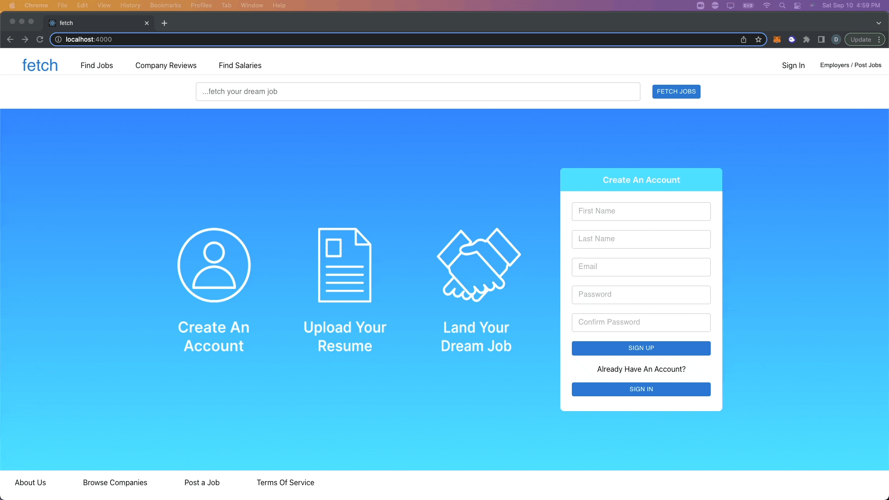
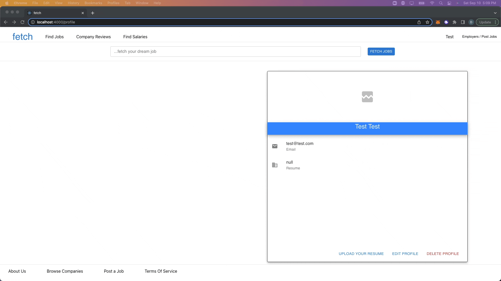

# Fetch

A React/Rails web application for job searching.
 
 
To watch the <a href="https://www.loom.com/share/ca69e8a0b36b474b8666c6072445e704"> Demo </a>  

## Overview

- Users can view and apply to job postings, and find applied to jobs on their personal profile
- Users can view the details of companies who posted jobs, and all jobs posted from a company
- Users have full CRUD capabilities on their own account

## GIFs

|  |
:-------------------------:
| Login and Signup |

 

|  |
:-------------------------:
| Edit Profile and Apply to Job Postings |
  

## Credits

Developed with Kevin Nielsen and Christian Stringham -
